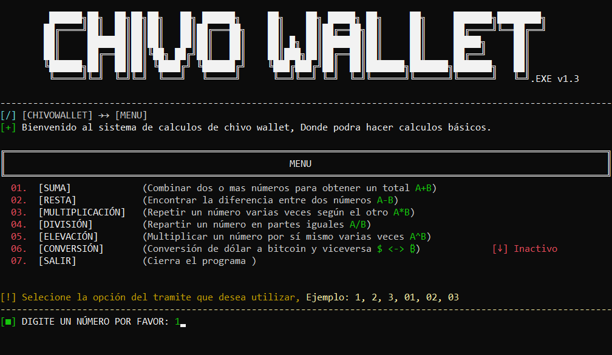
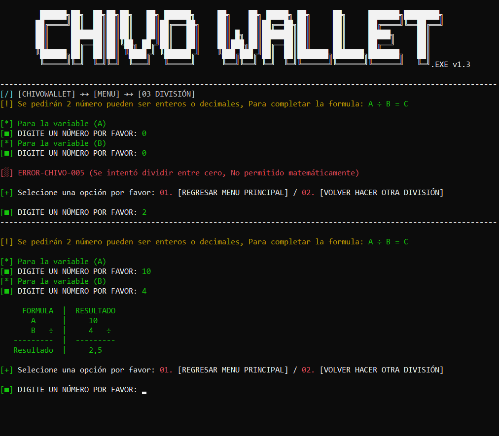

# Nombre del Proyecto
CHIVO WALLET

## LENGUAJE DE PROGRAMACIÓN
C#

## Instalación
- [+] Simplemente descarga el proyecto y ejecuta el CHIVO_WALLET.exe

# Creador
- Github: Prof. Jonathan Urquilla

# Licencia
**[=] LICENSE**
